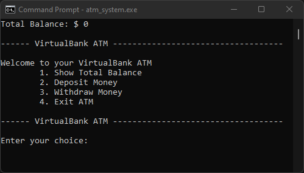
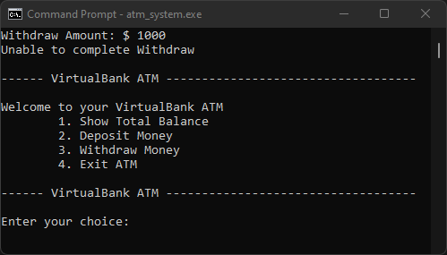
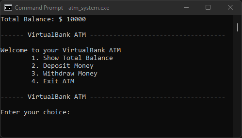

# The_VirtualBank_ATM
AN ATM program coded with C++.

This program will allow you to view your balance, deposit and withdraw money.

You can add $$$$ into your account and watch your balance grow! 🤑

-----

# Screenshots

Screenshot above shows the total balance of your account 😲 by default, you will begin with $0.

-----

Screenshot above shows withdraw being rejected, this is because the withdraw request exceeds the total balance 🙂

-----

Screenshot above shows the total balance changing after deposit had been made.

-----
